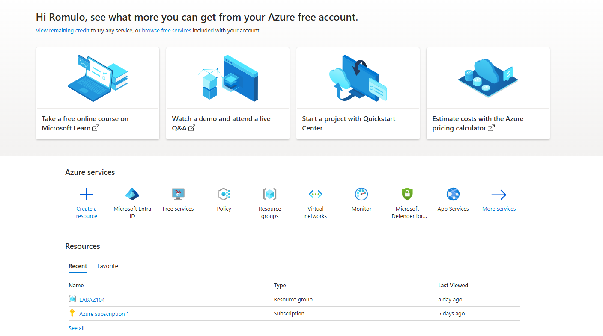
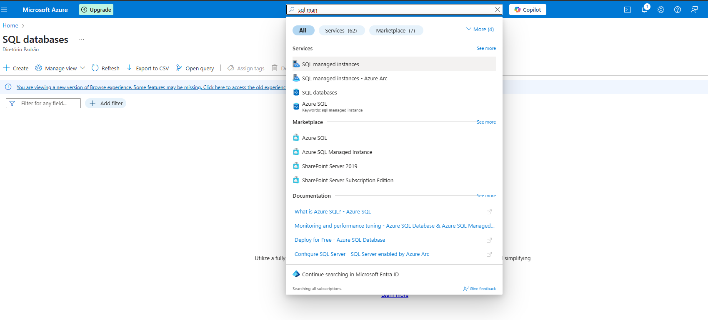
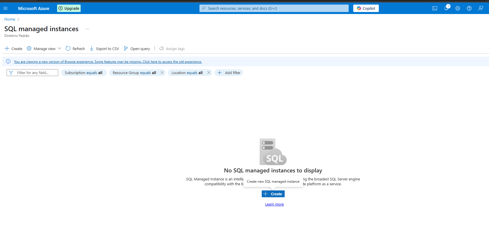
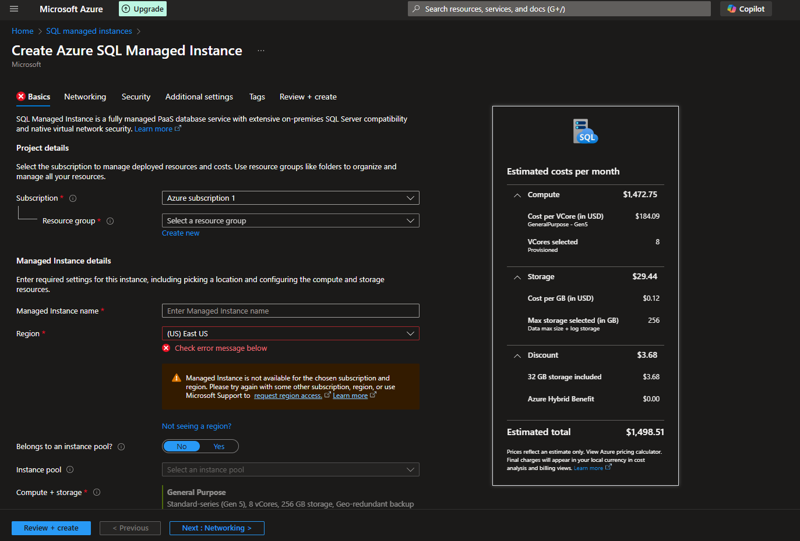
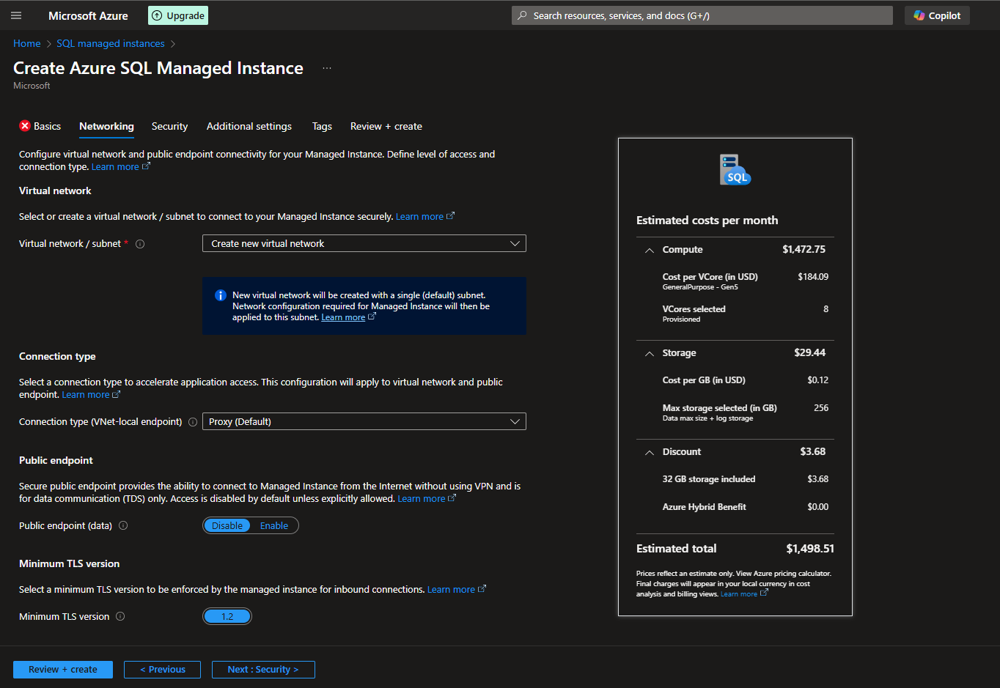
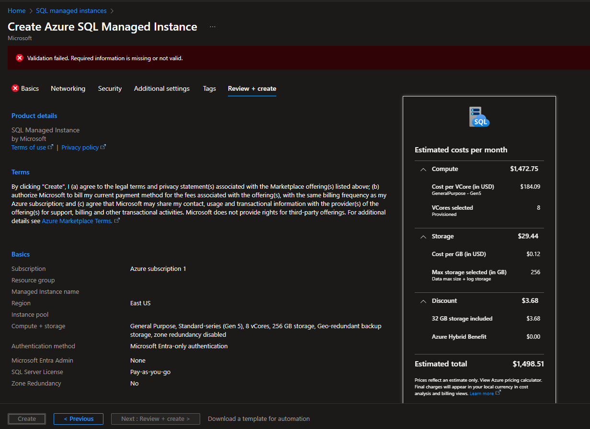

# 🚀 Criação de Instância Gerenciada do Azure SQL via Portal

Este guia é baseado na documentação oficial da Microsoft ([link aqui](https://learn.microsoft.com/pt-br/azure/azure-sql/managed-instance/instance-create-quickstart?view=azuresql&tabs=azure-portal)) e apresenta um passo a passo para criar uma **Instância Gerenciada do Azure SQL** pelo portal web, com imagens de apoio.

---

## 📋 Pré-requisitos

- Conta ativa no [Portal do Azure](https://portal.azure.com/)
- Permissão para criar recursos no Azure
- Subscrição válida (com créditos ou plano ativo)

---

## 🧭 Etapas para Criar uma Instância Gerenciada

### 1. Acesse o Portal Azure

Entre em [https://portal.azure.com](https://portal.azure.com) com sua conta.

📸 

---

### 2. Buscar por "Instância Gerenciada do SQL"

Na barra de pesquisa, digite **"Instância Gerenciada do SQL"** e selecione **Instâncias gerenciadas do SQL (Azure SQL Managed Instances)**.

📸 

---

### 3. Clique em "Criar"

Clique em **"+ Criar"** para iniciar o processo de configuração.

📸 

---

### 4. Preencha a Guia "Básico"

Informe os dados obrigatórios:

- **Assinatura**
- **Grupo de recursos** (crie um novo ou selecione existente)
- **Nome da instância**
- **Região** (ex: Brazil South)
- **Camada de preço** (geralmente "General Purpose")
- **Versão do SQL Server**
- **Usuário e senha do administrador**

📸 

---

### 5. Configure a Rede

Na guia **Rede**, escolha:

- **Tipo de conectividade**: público ou privado
- **Grupo de segurança de rede (NSG)** ou regras de firewall, se necessário
- **Sub-rede** (se for necessária, será criada automaticamente)

📸 

---

### 6. Configurações Adicionais

Você pode configurar backups, alta disponibilidade, replicação geográfica e outras opções em guias avançadas. Se preferir, aceite os padrões e clique em **Revisar + Criar**.

📸 

---

### 7. Criar Instância

Após validação das configurações, clique em **Criar**. A implantação pode levar até **6 horas** em alguns casos.

📸 

---

### 8. Conectar-se à Instância

Depois da implantação:

1. Vá até a instância criada
2. Copie o nome do servidor (FQDN)
3. Conecte-se via SSMS ou Azure Data Studio com os dados:

